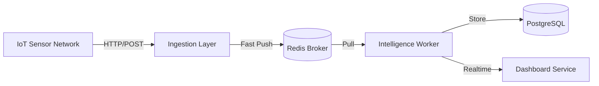

# 🏗️ Flow-Monitor: Arquitectura Industrial & Plan IaC

Este documento define la hoja de ruta para transformar el prototipo actual en una solución distribuida, escalable y resiliente, capaz de soportar cargas de >2 Millones de transacciones por ciclo.

## 1. Arquitectura de Microservicios Desacoplados

Pasamos de un monolito a una arquitectura orientada a eventos:

### Componentes:

| Componente | Tecnología | Responsabilidad | Escalabilidad |
|------------|------------|-----------------|---------------|
| **Ingestion Layer** | FastAPI (Async) + Uvicorn | Recibir datos y guardarlos *instántanemente* en Redis. Cero lógica de negocio. | Alta (Stateless) |
| **Message Broker** | Redis 7 | Buffer temporal para desacoplar picos de tráfico. | Vertical/Cluster |
| **Intelligence Worker** | Python Queue Worker | Procesar datos (IA, reglas), detectar anomalías y persistir resultados. | Horizontal (K8s HPA) |
| **Storage Layer** | PostgreSQL 16 | Almacenamiento histórico de lecturas y eventos críticos. | Vertical/Replicación |
| **Dashboard Layer** | React + NGINX | Visualización en tiempo real. | CDN / Estático |

---

## 2. Estrategia de Contenerización (Docker)

Crearemos imágenes Docker optimizadas para cada servicio para garantizar entornos inmutables.

- **`Dockerfile.ingestion`**: Imagen base `python:3.11-slim`. Optimizada para alta concurrencia (`uvloop`).
- **`Dockerfile.worker`**: Imagen con las librerías de IA y lógica de negocio.
- **`Dockerfile.dashboard`**: Multi-stage build (Node.js build -> NGINX alpine run).
- **`Dockerfile.db`**: Configuración custom de PostgreSQL para series temporales (opcional: TimescaleDB).

---

## 3. Orquestación con Kubernetes (K8s)

Utilizaremos K8s para gestionar el ciclo de vida y escalado automático.

### Estructura de Manifiestos (`k8s/`):
*   `00-namespace.yaml`: Aislamiento de recursos.
*   `01-redis.yaml`: Deployment + Service para el broker.
*   `02-db.yaml`: PostgreSQL StatefulSet + PVC (Persistencia).
*   `03-ingestion.yaml`: Deployment con **HPA** (Horizontal Pod Autoscaler) basado en CPU y Memoria.
*   `04-worker.yaml`: Deployment de workers consumidores.
*   `05-dashboard.yaml`: Servicio Frontend.
*   `06-ingress.yaml`: Reglas de enrutamiento y balanceo de carga.

### Políticas de Escalado (HPA)
- **Ingestion**: Escalar cuando CPU > 60%. Mínimo 2 réplicas, Máximo 20.
- **Workers**: Escalar basado en la longitud de la cola de Redis (Custom Metric) o CPU.

---

## 4. Orquestación de Datos

Para evitar la saturación del sistema durante "bombardeos" de datos:

1.  **Backpressure**: La API de ingesta responderá `202 Accepted` inmediatamente al recibir el dato, sin esperar procesamiento.
2.  **Batch Processing**: Los Workers procesarán mensajes en lotes (batch size: 100-500) para optimizar escrituras en BDD.
3.  **Data Retention**: Implementación de políticas de limpieza en BDD (ej: mantener raw data 7 días, agregados 1 año).

## 5. Próximos Pasos (Hoja de Ruta)

1.  ✅ **Definir Arquitectura** (Este documento).
2.  ⬜ **Crear Dockerfiles** para cada microservicio.
3.  ⬜ **Refactorizar Código**: Separar `run_pipeline.py` en `ingest_api.py` y `worker.py`.
4.  ⬜ **Generar Manifiestos K8s**.
5.  ⬜ **Despliegue Local**: Probar con `docker-compose` como paso intermedio.
6.  ⬜ **Despliegue K8s**: Validar en Minikube/Cluster real.
